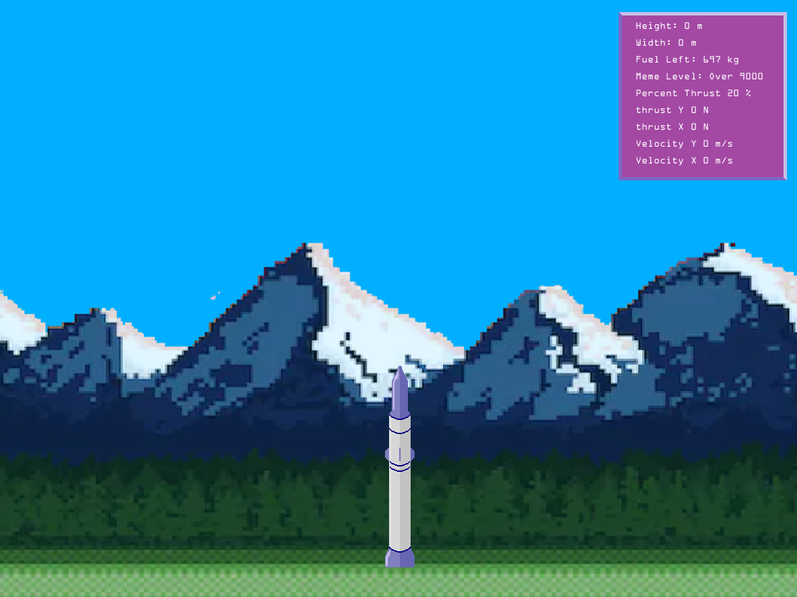
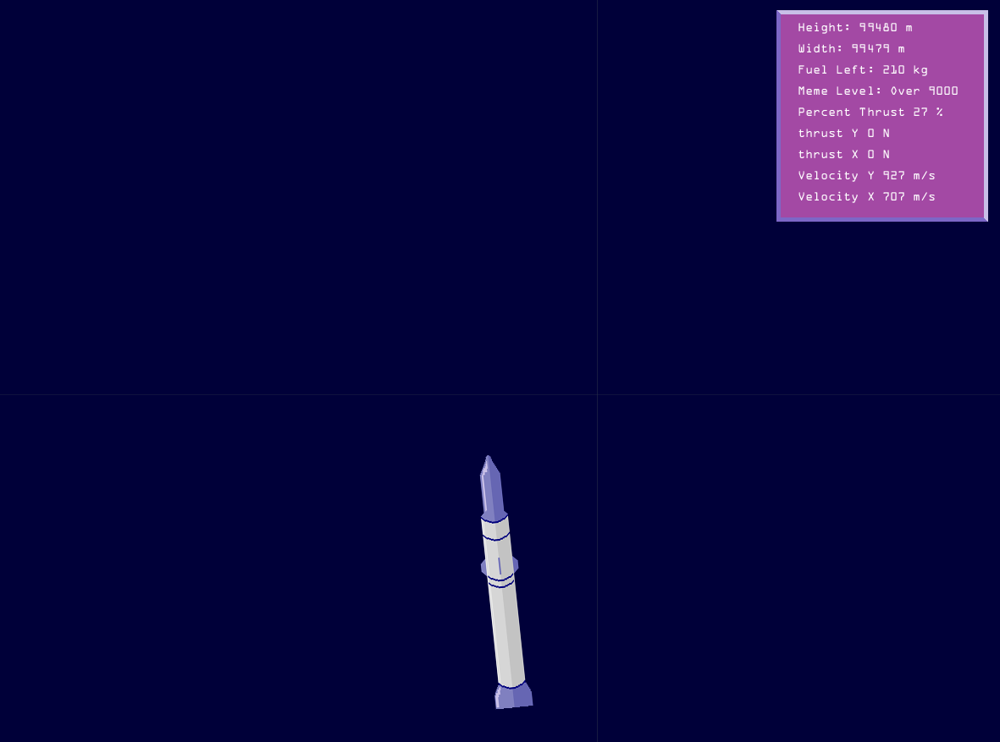

# Rocket-Calc-Game
This was a rocket simulation game developed with a self-made calculus-based physics engine. Feel free to pull the code and play the game. 

## Controls:

w: engine on

a: turns rocket left

d: turns rocket left

j: thrust % lower

k: thrust % higher

## In-game Pictures

Ground View

Cloud View

Space View

